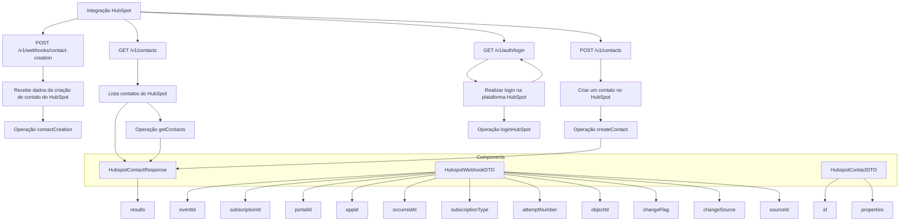

```mermaid
graph TD
  A[Integração HubSpot] --> B[POST /v1/webhooks/contact-creation]
  A --> C[GET /v1/contacts]
  A --> D[POST /v1/contacts]
  A --> E[GET /v1/auth/login]

  B --> F[Recebe dados de criação de contato do HubSpot]
  C --> G[Lista contatos do HubSpot]
  D --> H[Criar um contato no HubSpot]
  E --> I[Realizar login na plataforma HubSpot]

  F --> J[Operação contactCreation]
  G --> K[Operação getContacts]
  H --> L[Operação createContact]
  I --> M[Operação loginHubSpot]

  subgraph Components
    N[HubspotWebhookDTO]
    O[HubspotContactDTO]
    P[HubspotContactResponse]
  end

  N --> Q[eventId]
  N --> R[subscriptionId]
  N --> S[portalId]
  N --> T[appId]
  N --> U[occurredAt]
  N --> V[subscriptionType]
  N --> W[attemptNumber]
  N --> X[objectId]
  N --> Y[changeFlag]
  N --> Z[changeSource]
  N --> AA[sourceId]

  O --> AB[id]
  O --> AC[properties]

  P --> AD[results]

  G --> P
  K --> P
  L --> P

  I --> E
```